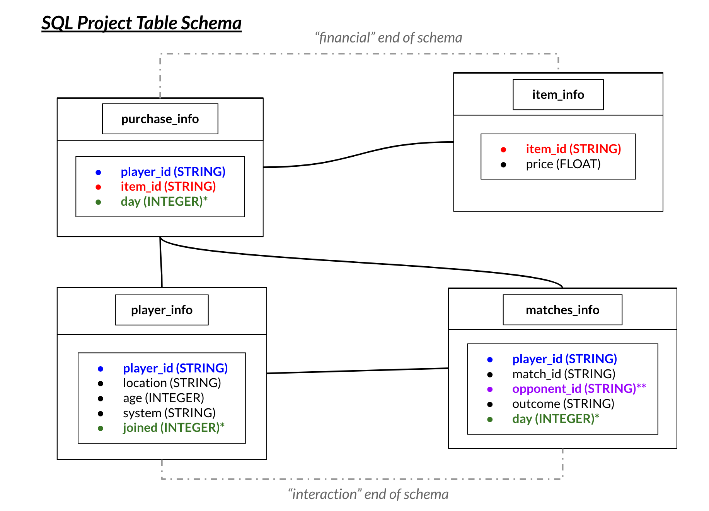
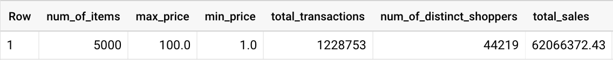
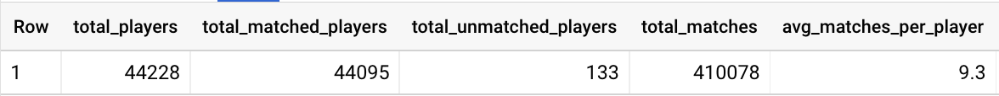
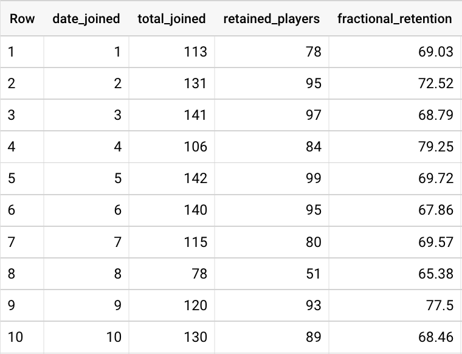
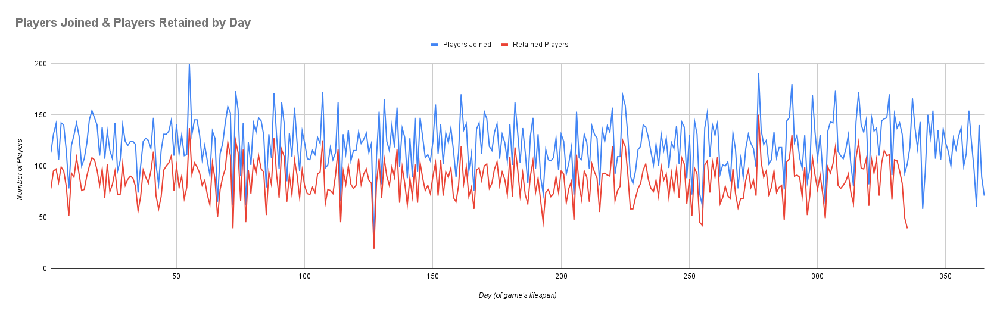
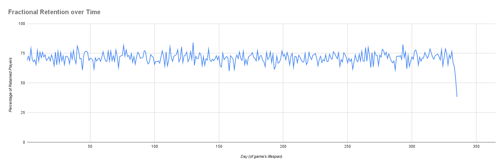
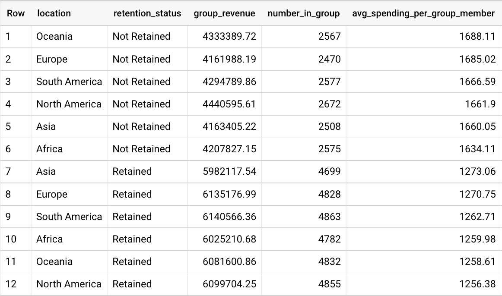
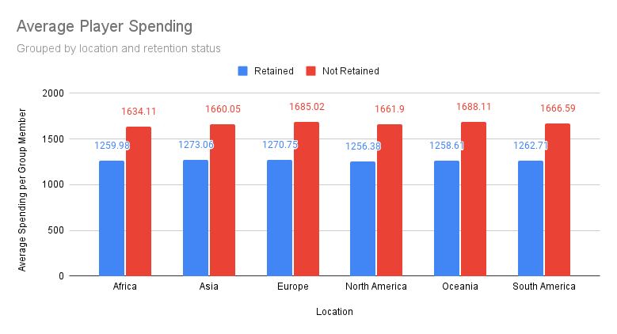

# **SQL Project Briefing**
## **Background**
In this scenario, we had been hired by a mobile game company to gain insights on player retention. In this game, players from across the globe can interact with one another by engaging in a head-to-head "match". Additionally, we were told that there exists a store in this game where players can purchase items of various kinds.

To start, building a table schema helped visualize where certain elements existed, where records could be connected, and how more elaborate questions could be answered in the deeper levels of analysis.

Beginning with a phase of exploratory data analysis (EDA), the "financial" side of the schema showed:
* distinct items
* range of prices
* number of transactions
* total sales

Similarly, on the "interaction" side of the schema revealed:
* number of players
* number of matches
* number of unmatched
* average matches per player

These numbers, to have on hand, served as quick references for quality assurance checks throughout the analysis.

## **Calculating Player Retention**

The task involved constructing a table ("retention table") that included columns for each of:
1. day (of game's lifespan)
1. number of players joined (on given days)
1. number of retained players (i.e., players that joined on the given day and ended up being retained)
1. fractional retention

Knowing that this resulting table would require input from both the `player_info` and `matches_info` tables, the two were joined. More specifically, a `RIGHT JOIN` was performed to validate pulling all records from the `player_info` table (forcing inclusion of players that may not have ever matched).

The first column would simply be the day of the game’s lifespan, represented as`joined` in the `player_info` table and `day` in the `matches_info` table.

The second column used a count of the number of distinct `player_id` s, grouped and ordered by the join day. In order to calculate “retention” in the third column (defined as “a player that has matched 30 days or more out from their initial join date), a `CASE` statement categorized players based on whether or not their most recent match day was 30 days (or more) after joining (i.e., greater than 29).

Finally, and perhaps more intuitively, the rightmost column shows the fractional retention over time (actually shown as a percentage, rounded to two decimal places), which can be translated as, “*from all that joined on day 2, how many stuck around [for at least 30 days]*?”. 

The first ten days of the game's lifespan of the query results are shown below:

*Retention chart* showing the number of players that joined each day, in addition to the number of players that were eventually retained (based on their join date). In other words, *did a given player play a match 30 days after they joined?* A player is either retained or not retained with respect to this retention metric.

From the *retention chart* above we note that the day of fewest joins was day 127 (27 joins), the day of greatest joins was day 55 (200 joins).

Similarly, looking at the *fractional retention chart* below, we can see that retention, on average, stayed above 70% throughout the course of the game's lifespan.

The day of lowest fractional retention was day 158 (60%), while the day of greatest fractional retention was day 130 (84.15%).

**Note**: In both the retention chart and the fractional retention chart above, the data end at day 335. The reason for this limitation is because the maximum day of the dataset is 365, thus we cannot tell whether or not a player would be retained without 30 or more days to continue matching.

## **Business Question: Analyzing spending trends of players, broken down by location and retention status** 

After constructing the table above (used for the *retention chart*), we sought out to answer find any patterns in spending across `retention_status` and `location`.

> Building upon Q1, what is the average spending per retained user grouped by location? (“How does overall spending compare by location amongst retained users? Do certain regions have bigger spenders than others?”) 

### *“How does overall spending compare by location amongst retained users?"*

To address this question, we sought out to build a table that would include the following columns:
1. Location
1. Retention status
1. Revenue (per group)
1. Number of players in each group
1. Average spending per group member

We started by making use of our retention table above (serving as a temporary table), knowing that we would have to categorize players by this status. Furthermore, players were categorized not only by their retention status but also by their location, forming twelve distinct subgroups (e.g., Africa & Retained, Africa & Not Retained, Asia & Retained, etc). This temporary table is referred to as `retention_table`.

In order to relate this to information regarding which items were sold and their respective prices, a second temporary table was created by `INNER JOIN`ing the `item_info` and `purchase_info` tables. This second temporary table is referred to as `financial_table`.

Finally, we joined the`retention_table` and the `financial_table` using a `LEFT JOIN` (to ensure that all players were accounted for, even those that never purchased an item).

The result of our query is shown below, ordered in descending amount of average spending per group member:

From this table, we can see that the *Oceania & Not Retained* group spent the most, on average, while the *North America & Retained* group spent the least, on average. Additionally, though it is curious that the *Not Retained* groups all spent more, on average, than their *Retained* counterparts, it should be reassuring to note that, within each location, there were more retained players than not retained. 

## Conclusions, Insights, and Recommendations

After analyzing the game data across all four tables, the following conclusions can be drawn:
* While retention did not seem to increase significantly over the game's lifespan, with a fractional retention rate averaging around 70% over 365 days, interest and long-term engagement is strong.
* On average, non-retained players spend more than retained players, though the number of individual players in a continent's "retained" group is much greater than its "not retained" group.
* Further areas of exploration include analyzing item "benefit" (price/quantity and their impact on wins/losses), ages of or systems used by winningest players, and spending habits as they relate to wins/losses for the individual player.
